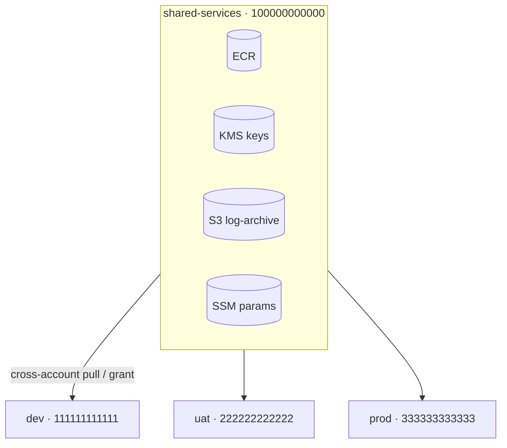
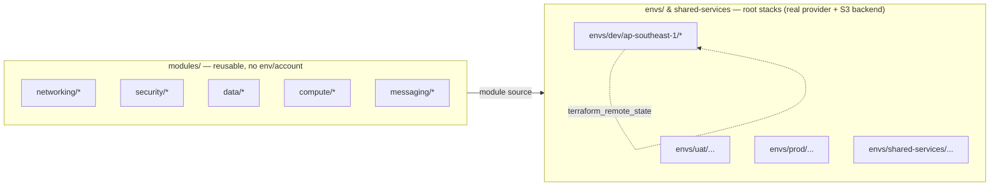
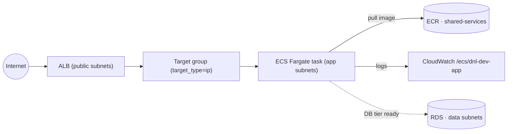
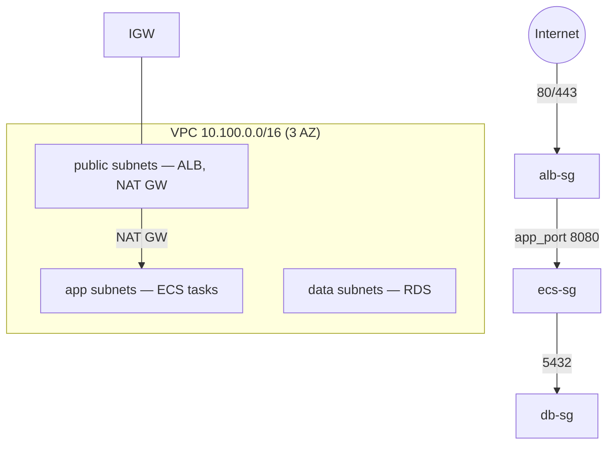
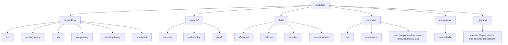
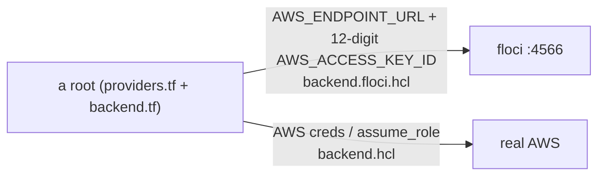

# Architecture & docs index

Real, **copy-and-run-on-AWS** Terraform for a multi-account AWS platform. It is
developed and tested locally against the **floci** emulator (no real cloud spend),
but the code itself is plain real-AWS — no emulator config is committed.

- New here? Start with the root [`../README.md`](../README.md) (quick start) and
  [`../AGENTS.md`](../AGENTS.md) (canonical repo rules + runbook).
- This file = the **architecture overview + diagrams + docs map**.

## Docs map

| Doc | What it is |
|---|---|
| [naming-conventions.md](naming-conventions.md) | Naming standard (HCL, folders, AWS names, tags) |
| [floci-unsupported.md](floci-unsupported.md) | floci capability gaps + re-check runbook (single source of truth) |
| [connectivity-patterns.md](connectivity-patterns.md) | VPC Peering vs PrivateLink vs Transit Gateway (prod networking design) |
| [enterprise-roadmap.md](enterprise-roadmap.md) | Forward-looking enterprise backlog |
| [terragrunt-plan.md](terragrunt-plan.md) | Terragrunt adoption plan (planning only) |
| [REFACTOR-PLAN.md](REFACTOR-PLAN.md) | Architecture decisions + refactor history (done) |
| [subnet.csv](subnet.csv) | CIDR allocation (source of truth) |

---

## 1. Multi-account model

One account per environment plus a shared-services account. On real AWS the
account is selected by credentials / `assume_role`; on floci by a 12-digit
`AWS_ACCESS_KEY_ID` (floci isolates resources per access key).

## 2. Repo layers (3-layer model)

Modules are provider-agnostic (no `provider` blocks). Each root under `envs/*`
is a standalone Terraform root with its own `providers.tf` + `backend.tf`.

## 3. dev ECS stack (the reference real workload)

`envs/dev/ap-southeast-1/networking` + `.../ecs`. The `ecs` root reads the
`networking` root's outputs via `terraform_remote_state` (S3).

## 4. Network topology & security-group chain (per env)

3-tier VPC (`10.100.0.0/16` for dev), 1 subnet per tier per AZ. SG chain is
strict: internet → ALB → ECS → DB.

## 5. Module tree

## 6. Same code, two targets (floci vs real AWS)

The committed code is real AWS. Local testing only changes **environment + backend
config**, never the `.tf`.

State: S3 backend with **native locking** (`use_lockfile = true`, Terraform
≥ 1.11, no DynamoDB). Create the bucket once via
[`../scripts/bootstrap-state-bucket.sh`](../scripts/bootstrap-state-bucket.sh).

---

> floci capability gaps (peering, TGW, flow logs, egress-only IGW, gateway VPC
> endpoint, AWS-managed IAM policies, `assume_role` account isolation) and the
> re-check runbook live in **[floci-unsupported.md](floci-unsupported.md)**.
