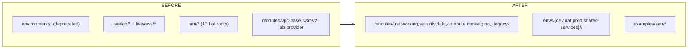

# Architecture decisions & refactor history

> Status: **DONE** (2026-06). Historical record of the refactor that produced the
> current layout. Live capability info → [floci-unsupported.md](floci-unsupported.md);
> naming → [naming-conventions.md](naming-conventions.md); architecture →
> [README.md](README.md).

## Locked decisions

| Topic | Decision |
|---|---|
| Module style | Hand-write VPC, security-group, ALB, IAM, Pod Identity (not IRSA), WAFv2, S3, KMS, SSM, ECR, ECS. **Wrap community** only for **EKS** (`terraform-aws-modules/eks` `21.0.6`). RDS skipped. |
| Account model | Multi-account: `dev 111… / uat 222… / prod 333… / shared-services 100…`. |
| Shared services | ECR, s3-logs, KMS, SSM live in the shared-services account; granted cross-account. |
| Layout | `modules/<group>/<name>` + `envs/{dev,uat,prod,shared-services}/<region>/<component>` + `examples/iam/*`. |
| Emulator | **floci only** (+ floci-ui); ministack removed. floci `1.5.27`, floci-ui `0.1.0`. |
| Identity | EKS **Pod Identity** standard; IRSA kept once under `_legacy/` for reference. |
| Providers | Every root is **real** (no symlink, no emulator config in code). floci tested via env (`AWS_ENDPOINT_URL` + 12-digit `AWS_ACCESS_KEY_ID`). |
| State | S3 backend + **native locking** (`use_lockfile`, Terraform ≥ 1.11, no DynamoDB). |
| Naming | See [naming-conventions.md](naming-conventions.md). |

## What changed (layout)

Removed: `environments/`, `live/`, root `iam/`, `modules/vpc-base`,
`modules/waf-v2` (→ `security/wafv2`), `modules/lab-provider` + all symlinks,
ministack, `aws-ci.yml`, `bootstrap/`, `config/`, and four stale docs.

Built: the module groups above; `envs/dev` ECS stack (networking + ecs);
`envs/shared-services` (kms/s3-logs/ssm/ecr); `examples/iam/*` converted to real
providers (assume_role for cross-account). CI: fmt/validate/tflint/trivy/checkov/
test + floci integration; Trivy excludes downloaded modules (`trivy.yaml`).

## Verification baseline
`terraform fmt -check -recursive` clean; every `envs/*` + `examples/iam/*` root
`terraform validate` passes; dev networking→ecs applies end-to-end on floci
(S3 native lock enforced; ARNs carry the per-account id).
