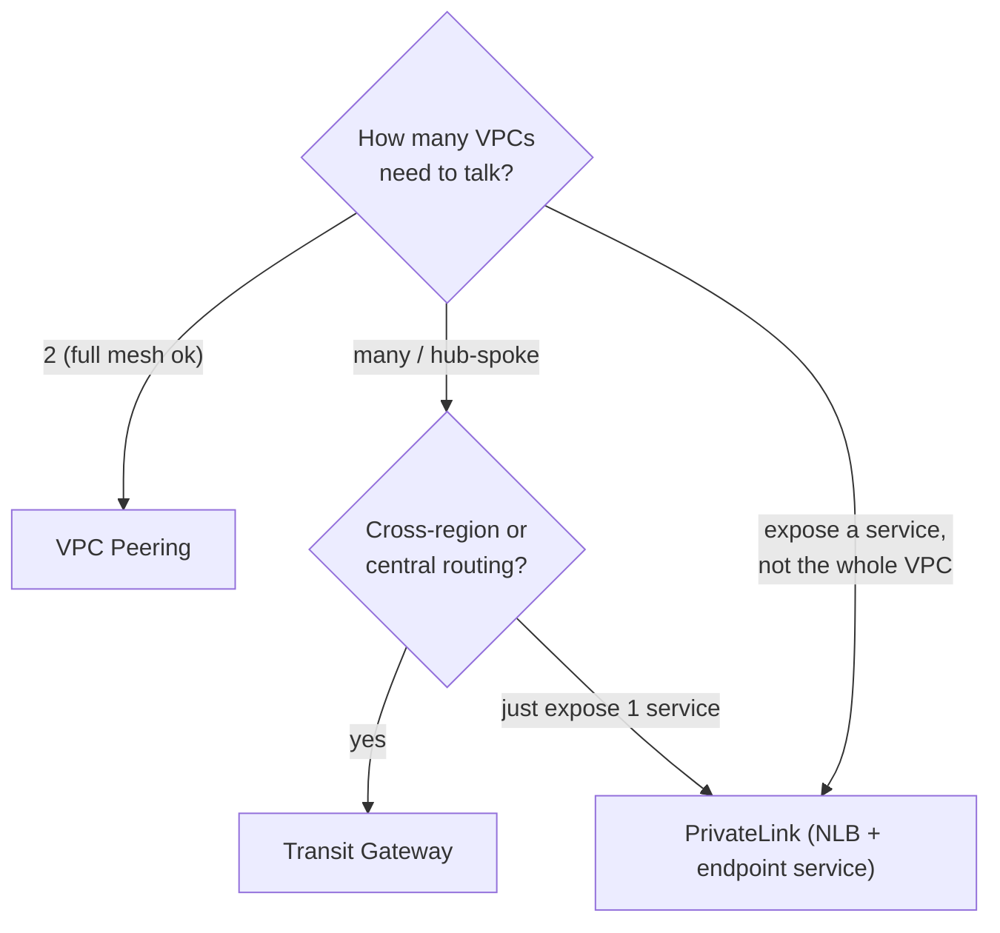
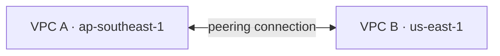
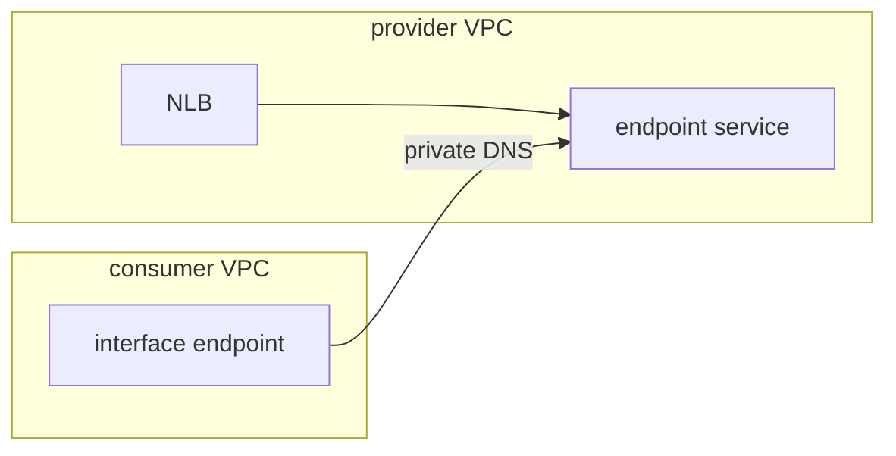
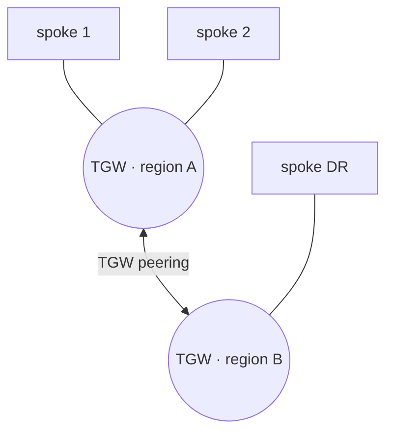

# Connectivity patterns — Peering vs PrivateLink vs Transit Gateway

Design rationale for the **prod networking** root
(`envs/prod/ap-southeast-1/networking`), which composes the cross-region/service
connectivity modules. On floci these are **`validate`/`plan`-only** (see
[floci-unsupported.md](floci-unsupported.md)); they apply on real AWS.

Modules: `networking/vpc-peering`, `networking/privatelink`,
`networking/transit-gateway` (+ `networking/vpc` main VPC, `security/wafv2` edge).

## When to use which

## Comparison

| | VPC Peering | PrivateLink | Transit Gateway |
|---|---|---|---|
| Connects | 2 VPCs (1:1) | a single **service** (one-way) | many VPCs (hub-spoke) |
| Routing | full route-table mesh | no routes — DNS to endpoint | central, scalable |
| Transitive | ❌ no | n/a | ✅ yes |
| Cross-region | ✅ | ✅ (inter-region endpoints) | ✅ (TGW peering) |
| Scale | poor (n² peerings) | great for service exposure | great for many VPCs |
| Cost shape | data transfer only | per-endpoint-hour + data | per-attachment-hour + data |
| Best for | a couple of VPCs | expose an app to consumers | org-wide mesh |

## Topologies

**Peering (cross-region, 1:1):**

**PrivateLink (service exposure, one-way):**

**Transit Gateway (hub-spoke, optionally cross-region):**

## Edge security (WAF v2)

`security/wafv2` attaches a Web ACL (AWS managed rule groups + optional rate-based
+ IP sets) to the ALB. `scope = REGIONAL` for ALB/APIGW; `CLOUDFRONT` requires
`us-east-1`.

## Notes

- Peering / TGW / PrivateLink are **not supported on floci** — keep their toggles
  off (`enable_transit_gateway`, `enable_privatelink`) and treat the modules as
  `validate`/`plan`-only learning material until floci adds support.
- For service-to-service inside one region, also consider **VPC Lattice**
  (application-layer, identity-aware) — out of scope here; noted for completeness.
