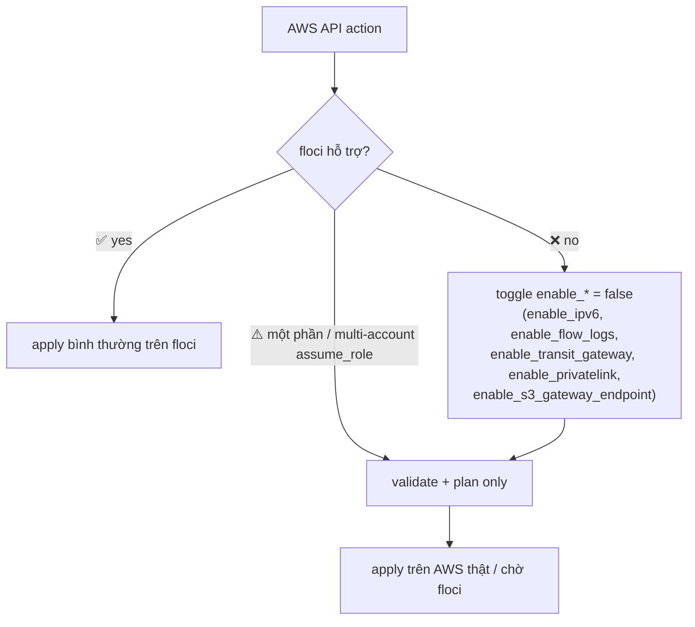

# floci — Unsupported operations & re-check log

> Probe gần nhất: **2026-06-24, floci `1.5.27`** (`./scripts/probe-floci.sh`).
> floci-only (đã bỏ ministack). Khi floci release thêm → chạy lại probe & cập nhật bảng + bật toggle tương ứng.

## Không hỗ trợ (xác nhận `UnsupportedOperation`)

| AWS API action | TF resource bị ảnh hưởng | Quyết định (tạm) | Toggle / vị trí |
|---|---|---|---|
| `CreateEgressOnlyInternetGateway` | `aws_egress_only_internet_gateway` | **Disable IPv6 tạm thời** | `enable_ipv6 = false` (module `networking/vpc`) |
| `CreateFlowLogs` | `aws_flow_log` (+ log group/role) | **Chưa cần** | `enable_flow_logs = false` (module `networking/vpc`) |
| `CreateVpcPeeringConnection` | `aws_vpc_peering_connection*` | **Chưa cần / disable** | module `networking/vpc-peering` → chỉ `validate`/`plan`, không apply |
| `CreateTransitGateway` | `aws_ec2_transit_gateway*` | **Disable** | `enable_transit_gateway = false` (module `networking/transit-gateway`) |
| AWS-managed IAM policies (e.g. `arn:aws:iam::aws:policy/...`) | `AttachRolePolicy` → `NoSuchEntity` | floci does not preload managed policies. Modules use **inline equivalents** (e.g. `ecs-service` execution role). On real AWS attach managed ARNs via the module's `*_managed_policy_arns` var. |
| `aws_vpc_endpoint` Gateway (S3) | `CreateVpcEndpoint` → response not parseable by AWS provider (`deserialization failed ... routeTableId`) | Raw CLI passes, but the TF provider can't decode floci's XML. Set `enable_s3_gateway_endpoint = false` on floci (works on real AWS). |
| `ReplaceRoute` (in-place route update) | `UnsupportedOperation` | floci supports `CreateRoute` (fresh apply) but not replacing a route. A re-apply over **partial state** can hit this — for the lab, restart floci for a clean slate rather than re-applying a half-failed run. |
| ECS service delete | drains slowly / may not complete | `terraform destroy` of an ECS service can hang on floci. Restart floci to reset emulator state. |
| `assume_role` account switching | not isolated | floci isolates accounts by **access key** (12-digit `AWS_ACCESS_KEY_ID`), not by `sts:AssumeRole`. Roots that use real provider **aliases with `assume_role`** for cross-account (the `examples/iam/*` demos) are therefore **validate/plan-only** on floci — apply won't land resources in the assumed account until floci supports assume-role account switching. Single-account roots (all `envs/*`) work fully via `AWS_ENDPOINT_URL` + per-root `AWS_ACCESS_KEY_ID`. |

### Behaviour confirmed WORKING on floci (good news)

| Capability | Status | Notes |
|---|---|---|
| **S3 native state locking** (`use_lockfile = true`, no DynamoDB, TF ≥ 1.11) | ✅ **enforced** | floci honors S3 conditional writes (`If-None-Match`). A held `.tflock` correctly blocks a second op with "Error acquiring the state lock". |
| **S3 backend** for state (versioning + AES256 + public-access-block) | ✅ | `aws s3api create-bucket` + put-versioning/encryption/public-access-block all work. |
| ECS Fargate cluster/service/task + ALB + target group + listener | ✅ apply | Full dev stack applies; `target_type = ip`. ECR registry is served on host port **5000** (`<acct>.dkr.ecr.<region>.localhost:5000`). |
| `terraform_remote_state` (S3) cross-stack reads | ✅ | ecs stack reads the networking stack's outputs from floci S3. |
| Provider routing via `AWS_ENDPOINT_URL` | ✅ | Real-AWS provider code works against floci with only env vars set (no endpoints in code). |

## Chưa probe — giả định cần kiểm khi làm

| Hạng mục | Trạng thái | Khi nào kiểm |
|---|---|---|
| PrivateLink — `CreateVpcEndpointServiceConfiguration` | ⚠️ nhiều khả năng thiếu (cùng họ peering/TGW) | Phase 3, module `privatelink` → `enable_privatelink = false` |
| VPC **Interface** endpoint (KMS/STS/ECR) | ⚠️ chưa probe (Gateway S3 đã ✅) | Phase 3 khi thêm interface endpoints |
| EKS Pod Identity (`eks-pod-identity-agent` addon, `CreatePodIdentityAssociation`) | ⏳ chưa probe | Phase 4: `PROBE_EKS=1 ./scripts/probe-floci.sh` |
| KMS multi-account / aliased provider | ⏳ (single-account `CreateKey` đã ✅) | Phase 2 khi làm kms cross-account |

## Đã hỗ trợ tốt (apply được trên floci)

VPC core (vpc/subnet/IGW/**NAT GW**/route-table/NACL) · VPC endpoint **Gateway (S3)** · **ELBv2** (target group) · **WAFv2** (web ACL/IP set) · IAM/STS · **KMS** · **SSM SecureString** · **ECR** · **Multi-account isolation** (access key 12 số).

## Quy trình re-check khi floci ra bản mới

```bash
# 1. Find the latest stable tag on Docker Hub (org `floci`), then bump
#    docker-compose.yml (floci/floci:<new>):
curl -s "https://hub.docker.com/v2/repositories/floci/floci/tags?page_size=10" \
  | python3 -c "import sys,json;[print(t['name']) for t in json.load(sys.stdin)['results']]"
# 2. Up lại + probe
./scripts/setup.sh
./scripts/probe-floci.sh          # + PROBE_EKS=1 cho EKS
# 3. Action nào chuyển PASS → đổi ✅ ở bảng trên + bật toggle (enable_* = true) ở root tương ứng
```

> Các module của feature chưa hỗ trợ **vẫn được viết đầy đủ để học** (chạy `terraform validate`/`plan`), chỉ không `apply` trên floci. Khi lên AWS thật hoặc floci hỗ trợ → bật toggle là dùng được.

## Quyết định khi 1 action chưa được hỗ trợ


