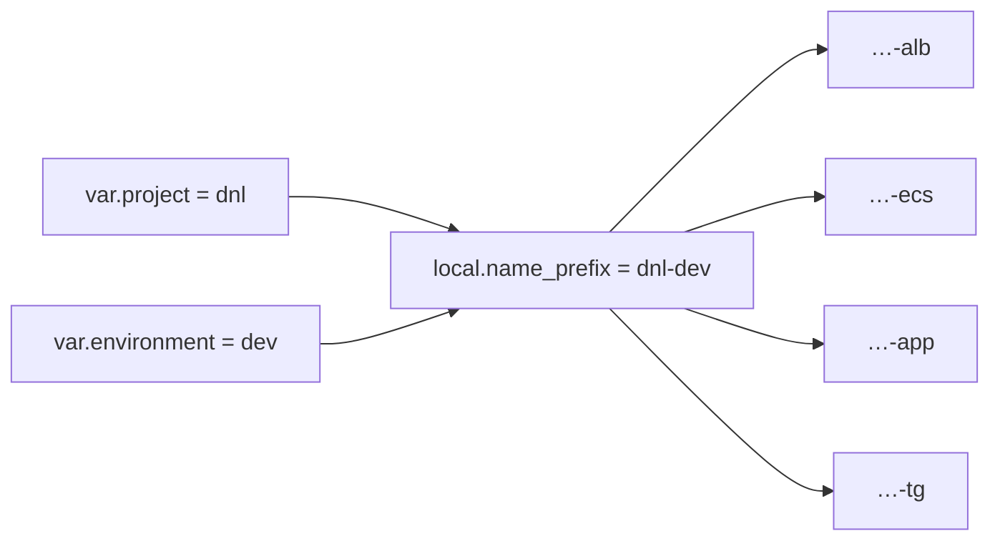
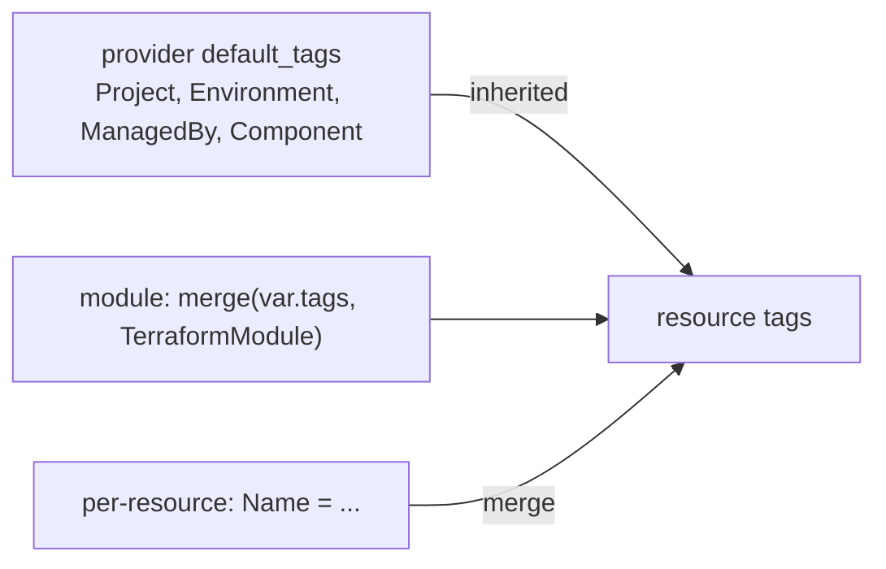

# Naming Conventions — tf-local

> Chuẩn đặt tên cho toàn repo. Nguồn: [HashiCorp Terraform Style Guide](https://developer.hashicorp.com/terraform/language/style) + thực tiễn AWS multi-account. Áp dụng cho mọi module/root mới và khi refactor code cũ.

## Nguyên tắc vàng: underscore vs hyphen

| Đối tượng | Quy ước | Lý do |
|---|---|---|
| **Định danh trong HCL** (resource/data label, variable, output, local, module) | `snake_case` (gạch dưới) | Chuẩn HashiCorp; hyphen không hợp lệ cho identifier |
| **Tên thư mục / module folder** | `kebab-case` (gạch ngang) | Đọc dễ, hợp URL/registry |
| **Tên resource vật lý trên AWS** (Name tag, bucket, role, cluster…) | `kebab-case`, lowercase | Nhiều dịch vụ AWS (S3, ALB, …) cấm underscore / theo dạng DNS |

## 1. Code Terraform (HCL)

### Resource & data labels
- Là **danh từ**, `snake_case`, **KHÔNG lặp lại loại resource** (loại đã nằm trong address).
- Module **đơn resource** → dùng label `this`.

```hcl
# ✅ đúng
resource "aws_vpc" "this" {}
resource "aws_subnet" "public" {}
resource "aws_iam_role" "task" {}

# ❌ sai (lặp type / thừa)
resource "aws_vpc" "vpc_main" {}
resource "aws_subnet" "public_subnet" {}
resource "aws_iam_role" "task_role" {}
```

- Đặt resource phụ thuộc **sau** resource nó tham chiếu (code build-on-itself).

### Variables & outputs
- `snake_case`, luôn có `type` + `description`; `sensitive = true` cho secret; default khi hợp lý.
- Output đặt theo cái nó expose: `vpc_id`, `public_subnet_ids`, `cluster_name`.
- Biến boolean bật/tắt feature: tiền tố `enable_` (`enable_nat_gateway`, `enable_flow_logs`).
- Biến đếm/HA: hậu tố rõ nghĩa (`nat_gateway_count`, `single_nat_gateway`).

### Locals & tags
- `local.name_prefix`, `local.default_tags`, `local.module_label = basename(abspath(path.module))` (theo AGENTS.md).

### File layout chuẩn (mỗi module/root)
`terraform.tf` (version+provider req) · `providers.tf` · `backend.tf` · `variables.tf` · `main.tf` · `locals.tf` · `outputs.tf`.
Module lớn tách `main.tf` theo nhóm logic: `vpc.tf`, `subnets.tf`, `endpoints.tf`, …

## 2. Tên resource vật lý trên AWS (Name tag / physical name)

**Cách code thực sự làm** (đừng để doc lệch code): mỗi root có
`local.name_prefix = "${var.project}-${var.environment}"`, rồi resource = `${name_prefix}-<role>`.

Mẫu chung:

```
<project>-<env>-<role/suffix>
```

- `project` = short slug, mặc định **`dnl`** (duynhlab) — `var.project`.
- `env` ∈ `dev | uat | prod | shared` — `var.environment`.
- `role/suffix`: `alb`, `ecs`, `app`, `tg`, `db`, `logs`, …

Ví dụ (đúng như code hiện tại):
```
dnl-dev            # VPC (vpc_name = name_prefix)
dnl-dev-alb        # ALB security group / ALB
dnl-dev-ecs        # ECS task security group
dnl-dev-app        # ECS service / task / log group "/ecs/dnl-dev-app"
dnl-dev-tg         # ALB target group
dnl-shared         # KMS alias (shared-services)
dnl-shared-logs    # s3-logs bucket
dnl/backend        # ECR repo = "${var.project}/${repo}"
```

> Mở rộng tuỳ chọn (chưa dùng): thêm `region_short` (`apse1`/`use1`) khi đa region,
> hoặc `component` segment khi một env có nhiều stack trùng role. Triển khai bằng
> `local.name_prefix` ở root → truyền xuống module; **không hardcode** env/region trong module.



## 3. Thư mục & module

```
modules/<group>/<module-name>/     # kebab-case
  ví dụ: modules/networking/vpc, modules/security/pod-identity, modules/data/s3-bucket
envs/<env>/<region>/<component>/
  ví dụ: envs/dev/ap-southeast-1/networking
envs/shared-services/<region>/<component>/
examples/<domain>/<scenario>/
  ví dụ: examples/iam/cross-account-sns-sqs
```

Group module: `networking`, `security`, `data`, `compute`, `messaging`, `_legacy`.
Mỗi module = **một trách nhiệm**; tên là danh từ kebab-case, không nhét env.

## 4. Tags chuẩn (provider `default_tags` + merge per-resource)

| Tag | Nguồn | Bắt buộc |
|---|---|---|
| `Project` | provider default_tags | ✅ |
| `Environment` | provider default_tags (`dev/uat/prod/shared`) | ✅ |
| `ManagedBy` | `terraform` | ✅ |
| `Component` | per-root (network/eks/…) | ✅ |
| `Owner` | `duynhlab` | nên |
| `TerraformModule` | `basename(path.module)` (merge trong module) | ✅ (module) |
| `Name` | `merge(local.default_tags, { Name = ... })` per-resource | ✅ |

Không lặp `Project/Environment/ManagedBy` ở từng resource (đã có ở default_tags) trừ khi cần override. `default_tags` đặt ở `providers.tf` của mỗi root (đã set `Component`).



## 5. Account / Environment map (floci multi-account)

| env | account id (access_key) | prefix |
|---|---|---|
| shared-services | `100000000000` | `dnl-shared-…` |
| dev | `111111111111` | `dnl-dev-…` |
| uat | `222222222222` | `dnl-uat-…` |
| prod | `333333333333` | `dnl-prod-…` |

## 6. Git / commit
Theo AGENTS.md: conventional, imperative, subject ≤ 50 ký tự, không trailer attribution.
